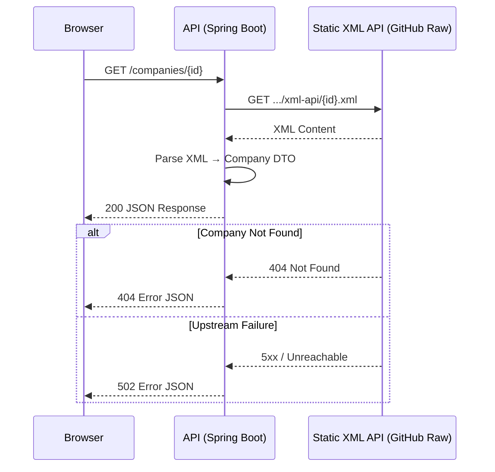

# MWNZ Evaluation

   

A clean Spring Boot REST API that fetches company data from a static XML API and transforms it into JSON.

---

## Table of Contents

- [Sequence Diagram](#sequence-diagram)
- [Tech Stack](#tech-stack)
- [Project Structure](#project-structure)
- [Getting Started](#getting-started)
- [API Reference](#api-reference)
- [Testing](#testing)
- [Assumptions](#assumptions)
- [Design Decisions](#design-decisions)
- [Known Limitations & What I'd Do With More Time](#known-limitations--what-id-do-with-more-time)
- [Production Considerations](#production-considerations)

---

## Sequence Diagram



**Layered structure:** `Controller → Service → Client`

Each layer has a single responsibility — the controller handles HTTP concerns, the service owns transformation logic, and the client is the only component aware of the upstream XML API.

---

## Tech Stack

| Layer | Technology | Reason |
|---|---|---|
| Language | Java 21 | LTS release; virtual threads available if needed |
| Framework | Spring Boot 3.3+ | Minimal boilerplate, production-ready defaults |
| Build | Maven | Standard, widely supported in CI environments |
| XML Parsing | Jackson XmlMapper | Already on classpath via Jackson; avoids JAXB ceremony |
| HTTP Client | Spring RestClient | Synchronous, fluent API — appropriate for this use case |
| Testing | JUnit 5 + MockMvc | Standard Spring testing stack |

---

## Project Structure

```
src/
├── main/java/com/mwnz/evaluation/
│   ├── EvaluationApplication.java
│   ├── config/
│   │   └── CompanyApiProperties.java
│   ├── controller/
│   │   └── CompanyController.java
│   ├── service/
│   │   └── CompanyService.java
│   ├── client/
│   │   └── XmlCompanyClient.java
│   ├── model/
│   │   ├── ErrorResponse.java
│   │   ├── Company.java
│   │   └── XmlCompany.java
│   └── exception/
│       ├── CompanyNotFoundException.java
│       ├── UpstreamServiceException.java
│       └── GlobalExceptionHandler.java
└── test/java/com/mwnz/evaluation/
    ├── controller/
    │   └── CompanyControllerTest.java
    └── service/
        └── CompanyServiceTest.java
```

---

## Getting Started

### Prerequisites

- Java 21+
- Maven

### Run Locally

```bash
git clone https://github.com/abdul-hakkim/mwnz-evaluation.git
cd mwnz-evaluation
./mvnw spring-boot:run
```

Application starts at `http://localhost:8080`.

### Quick Smoke Test

```bash
# Happy path
curl -X GET http://localhost:8080/companies/1

# Not found
curl -X GET http://localhost:8080/companies/999
```

---

## API Reference

### `GET /companies/{id}`

Retrieves a company by ID from the upstream XML source, returning a normalised JSON representation.

**Path Parameters**

| Parameter | Type | Description |
|---|---|---|
| `id` | integer | Company identifier |

**Success — `200 OK`**

```json
{
  "id": 1,
  "name": "MWNZ",
  "description": "..is awesome"
}
```

**Not Found — `404`**

```json
{
  "error": "NOT_FOUND",
  "error_description": "Company not found: 999"
}
```

**Upstream Unavailable — `502`**

```json
{
  "error": "UPSTREAM_ERROR",
  "error_description": "Unable to reach company data source"
}
```

---

## Testing

```bash
./mvnw test
```

**Coverage summary**

| Scenario | Covered |
|---|---|
| Valid company returned as JSON | ✅ |
| Unknown ID returns 404 with error body | ✅ |
| Upstream 404 mapped to application 404 | ✅ |
| Upstream unavailable returns 502 | ✅ |
| Malformed XML handled gracefully | ✅ |

---

## Assumptions

These were inferred from the brief rather than explicitly stated. I'd normally validate these in a kickoff conversation:

1. **ID type is a positive integer** — the XML filenames suggest numeric IDs; no validation of non-numeric input was specified but basic sanitisation is applied.
2. **The XML schema is stable** — no versioning or schema drift handling has been built in, as the source is a static fixture.
3. **No authentication required** — the brief did not mention auth on either the consumer or upstream side.
4. **Single-environment deployment** — no multi-environment config (dev/staging/prod profiles) has been wired up, though Spring profiles would be the natural approach.
5. **Read-only API** — only `GET` is implemented; no write operations were implied.

---

## Design Decisions

### XML fetched as `String`, then parsed with `XmlMapper`

Attempting to deserialise directly from the `RestClient` response stream caused inconsistent behaviour with GitHub raw URLs (content-type negotiation issues). Fetching as `String` first and then parsing is slightly less elegant but deterministic and easier to test.

**Alternatives considered:**

| Option | Trade-off |
|---|---|
| JAXB | More ceremony, requires generated classes or annotations; overkill for a two-field schema |
| Direct stream deserialisation | Fragile with GitHub raw content-type headers |
| `XmlMapper` on String | Slightly more memory — acceptable given payload size |

### `RestClient` over `WebClient` or Feign

The upstream call is a simple synchronous fetch with no fan-out. Reactive (WebClient) adds complexity with no benefit here. Feign would be appropriate in a microservices context with multiple downstream services.

### Constructor injection throughout

Avoids hidden dependencies, makes the dependency graph explicit, and simplifies unit testing without needing Spring context.

### Global exception handler (`@ControllerAdvice`)

Centralises error shaping so individual controllers stay clean and all error responses share the same structure regardless of where the exception originates.

---

## Known Limitations & What I'd Do With More Time

- **No circuit breaker** — if the GitHub raw endpoint is slow or flapping, requests will block until the default HTTP timeout. Resilience4j with a fallback would address this.
- **No caching** — the upstream data is static, so every request hits GitHub unnecessarily. A short-lived `@Cacheable` (or even a startup-time fetch) would eliminate that entirely.
- **No retry logic** — transient upstream failures result in an immediate error response. A simple retry with exponential backoff would improve resilience.
- **Hardcoded base URL** — currently in `application.properties`. In a real service this would be externalised to environment config / secrets manager.
- **No OpenAPI spec** — Springdoc would generate this automatically with minimal config; useful for any consumer integrating against this API.
- **No containerisation** — a `Dockerfile` and `docker-compose.yml` would make local setup and CI trivial.

---

## Production Considerations

- [ ] Authentication & authorisation (Spring Security / OAuth2)
- [ ] Timeouts, retries, and circuit breakers (Resilience4j)
- [ ] Response caching (Spring Cache + Redis or in-memory)
- [ ] Rate limiting and input validation
- [ ] OpenAPI documentation (Springdoc)
- [ ] Docker + CI/CD pipeline
- [ ] Structured logging and distributed tracing (Micrometer + OTEL)
- [ ] Health and readiness endpoints (Spring Actuator — included by default)
